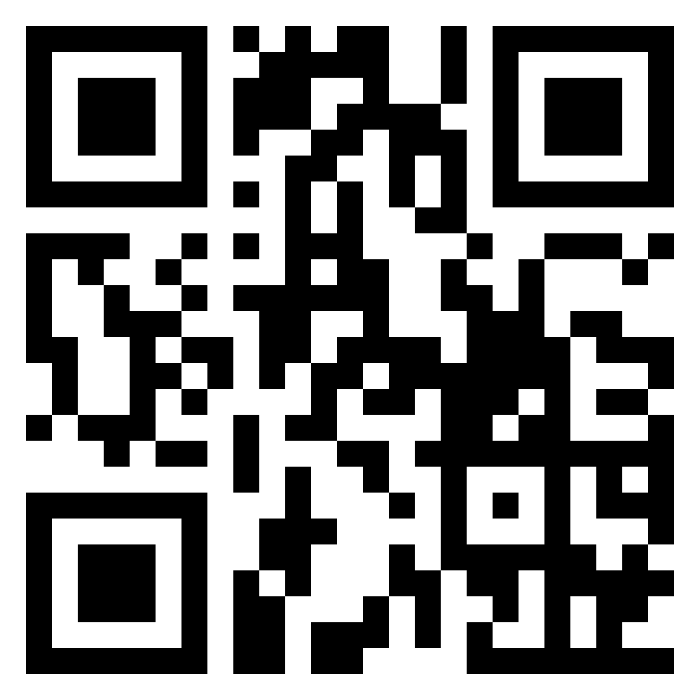

# 949's Scouting App - Osprey

This app was developed to facilitate the process of scouting at FRC competitions with no wifi, instead relying on QR Codes for communication.

## App Link

https://949-scouting-app-pink.vercel.app
https://scout.evang.dev

## Installation

### Android

-   Open the website.
-   Click the three dots in the top right corner.
-   Click `Install App` or `Add to Home Screen`.
-   Click Add.

### IOS

-   Open the website.
-   Click the share icon at the bottom.
-   Scroll down and click `Add to Home Screen`.
-   Click Add.

### Offline

To make sure that the app is ready for offline use

-   Open the app on the homescreen and wait up to a minute for the notification: `Precache Complete`.
-   If this message does not show up, click the settings icon, under Service Worker, click `Unregister`.
-   Close and reopen the app.

### Updates

To update the app:

-   Open the app to the homepage.
-   Click the settings icon.
-   Under the Delete All Data option, click `Clear`.
-   Under Service Worker, click `Unregister`.
-   Wait for the notification: `Precache Complete`.
-   Close and reopen the app.

## Usage

The login page requires the scouter to submit their name, in order to know who to blame when the data claims 949 lost.

### Data Collection

-   Click `Pit Scout` or `Match Scout`.
-   Fill the form.
-   Once you're done filling out form, click `Submit`.
-   To edit a submitted entry, click the desired entry at the top of the page.

### Export to QRCode

-   Once data has been collected, click `Export` at the bottom of the page.
-   On the export page, choose between exporting Pit and Match data in the select option.
-   Once scanned in by a main device, click the entries at the top in order to remove them from the rendering, or you could simply click `Mark All Done`.

### Data Aggregation

-   On a main device, on the homescreen, hit `Aggregate Data`
-   If the app chose the wrong camera, go to settings and change it.
-   Scan all QR codes of one device in order, and once all parts have been scanned the data should be automatically bundled. If there is a mistake, click `Cancel Parts`.
-   Once all devices are scanned, swipe up or click `Open Console`, and click the appropriate export button.

## Development

The code is very spaghetti and there's limited comments and documentation, so if you need help please reach out to Andrew, who is responsible for the mess.

### Change the Form (for the different games season to season)

The form code itself is very abstracted, the only thing that needs to be changed from season to season are the JSONs that are integrated throughout the app. They can be found under `src/jsons`. Throughout the app, they are parsed in order to render the forms and generate validation and Protobuf schemas.
